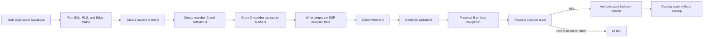

# Authenticated browser website isolation

## User story

As Destiny's product owner, I want a real signed-in user with access to multiple organizations to switch websites in the browser without losing context or seeing another customer's records, so the product cannot pass CI with a data-blending regression hidden behind otherwise-correct database policies.

## Acceptance criteria

1. The fixture runs only against a loopback Supabase URL and refuses a hosted project.
2. Owners A and B create separate organizations, websites, and audit histories through authenticated PostgREST requests.
3. User C owns a third organization and receives member access to organizations A and B; an outsider owns a fourth inaccessible website.
4. The fixture produces a temporary Supabase SSR cookie state and an ID-only manifest in the CI runner's temporary directory, never in the repository or uploaded evidence.
5. Playwright opens website A, verifies A's domain and audit count, uses the real website-switch link to open B, and verifies B's distinct domain and audit count.
6. Navigation without an explicit `site` query preserves B as the selected website.
7. User C receives `404 Audit not found` when requesting the outsider's real audit through Destiny's authenticated API.
8. Desktop and mobile projects execute the same journey before the disposable stack is destroyed without a backup.

## Scenarios

### Scenario: switching changes the complete workspace context

**Given** user C can access websites A, B, and C

**And** A has one saved audit while B has two

**When** C opens A and follows B's real website-switch link

**Then** the page's active website marker, domain, audit count, URL, and following unscoped navigation all resolve to B.

### Scenario: a valid outsider identifier reveals no record

**Given** user D owns an audit that user C cannot access

**When** C requests that exact audit ID through Destiny's authenticated API

**Then** the response is `404`

**And** the response contains no outsider record or website data.

### Scenario: local authentication cannot escape into production

**Given** the fixture starts after repository migrations on disposable Supabase

**When** its configured API URL is not loopback HTTP

**Then** setup aborts before creating any user, organization, session, or record.

## Flow

## Evidence boundary

This lane proves local authenticated application behavior. It does not claim that a production session, deployed build, or customer workspace passed. Production remains read-only and credential-gated under the separate post-deploy policy.
