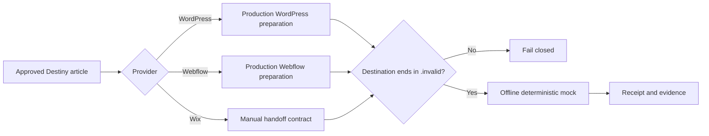

# Offline CMS adapter harness

## User story

As Destiny's product owner, I want every publishing-pipeline test to use deterministic offline CMS adapters so an agent can prove WordPress, Webflow, and Wix behavior without touching a client website.

## Acceptance criteria

1. The harness prepares a real approved Destiny article through the production WordPress and Webflow transformation functions before passing it to the mock provider.
2. WordPress and Webflow return deterministic draft receipts and editor URLs without calling the network.
3. Wix returns a truthful manual-handoff receipt and never claims that a draft was transferred or published.
4. Every mock destination must use the reserved `.invalid` top-level domain.
5. The harness explicitly refuses `clearcheck.app`, `98junkit.com`, `joseangelostudios.com`, their subdomains, and every other non-`.invalid` hostname.
6. Duplicate provider calls with the same article key return the same receipt instead of creating a second simulated item.
7. Empty articles, provider mismatches, and accidental live destinations fail closed.
8. The default `pnpm test` lane executes this smoke test without Docker, credentials, or repository secrets.

## Scenarios

### Scenario: an approved article reaches offline WordPress and Webflow drafts

**Given** an approved article that passes Destiny's production CMS preparation rules

**When** the smoke test transfers it to WordPress and Webflow mock adapters

**Then** each adapter returns a stable `draft_created` receipt and a `.invalid` editor URL, while no network request occurs.

### Scenario: Wix stays truthful

**Given** the same approved article

**When** the smoke test requests a Wix handoff

**Then** the adapter returns `manual_handoff_required` and no draft, schedule, publication, or live URL is claimed.

### Scenario: live client destinations fail closed

**Given** any production or ordinary public hostname

**When** a harness caller attempts a CMS transfer

**Then** the adapter rejects the operation before recording a call.

## Flow

