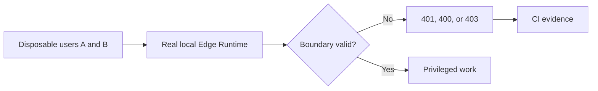

# Privileged Edge Function negative authorization

## User story

As a Destiny customer, I need every privileged Edge Function to reject an
anonymous or cross-website request before it can use the service role, contact
an external provider, or mutate data.

## Acceptance criteria

1. CI runs the real Supabase Edge Runtime against the disposable migrated database.
2. Every user-scoped privileged function receives a valid user A JWT with user
   B's website identifier and returns `403` before external work.
3. Account deletion receives no JWT and returns `401`.
4. The Google OAuth callback receives an invalid one-time state and returns `400`.
5. Rank refresh and digest jobs receive no cron secret and return `401`.
6. Test payloads contain only `.invalid` external URLs and dummy content.
7. The three disposable users and organizations are removed after the suite.
8. Calendar orphan repair receives a real user A JWT with user B's website and
   returns `403` before reading service-role calendar, draft, or transfer data.

## Scenarios

### Scenario: a valid user cannot operate another tenant's website

**Given** user A and user B are signed in to different organizations

**When** user A calls a privileged function with user B's website ID

**Then** the function returns `403`

**And** it does not reach service-role or provider work.

### Scenario: a background function has no scheduler secret

**Given** the disposable Edge Runtime

**When** a caller invokes a cron function without the configured secret

**Then** the function returns `401` before privileged queries.

### Scenario: a user cannot repair another website's calendar

**Given** user A and user B own different websites

**When** user A dry-runs calendar repair using user B's website and item IDs

**Then** the function returns `403`

**And** no calendar row or transfer evidence is read or changed through the
service-role client.

