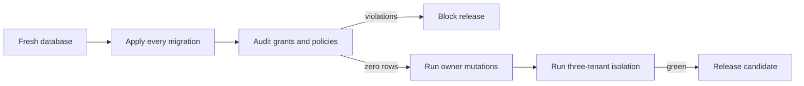

# Hosted grant and policy conformance

## User story

As a Destiny customer, I need database privileges and row-level policies to
agree so that my permitted actions work while no browser role can bypass tenant
isolation or inherit unsafe PostgreSQL privileges.

## Acceptance criteria

1. `anon` has no privileges on application tables, sequences, views, or public
   functions.
2. `authenticated` has only policy-backed CRUD privileges on public tables.
3. `authenticated` never has `TRUNCATE`, `TRIGGER`, or `REFERENCES` on an
   application table.
4. Every authenticated INSERT, UPDATE, or DELETE policy has its matching table
   privilege, and every matching privilege has a policy.
5. SELECT may be granted as the dependency for a policy-backed CRUD operation,
   but an authenticated table with no reviewed policy has no privileges.
6. Policies created for `public` are tightened to `authenticated` because
   Destiny has no anonymous workspace data path.
7. Public functions are not executable through PostgreSQL's implicit `PUBLIC`
   grant. Only the reviewed authenticated RPCs remain callable.
8. An owner can update their own website and mark their own notification read.
9. Cross-tenant reads stay empty; cross-tenant writes are either a grant-layer
   403 or an RLS-layer zero-row result according to the reviewed grant matrix,
   and the owner's row remains unchanged.
10. `service_role` has explicit CRUD grants on every public base table,
    explicit `USAGE` and `SELECT` grants on every public sequence, and explicit
    `EXECUTE` grants on every public routine; `PUBLIC` inheritance never
    satisfies this worker contract.
11. `PUBLIC` has no direct table or sequence privileges in the public schema.

## Scenarios

### Owner operations remain functional

**Given** an authenticated owner with one website and one notification

**When** the owner updates the website and marks the notification read

**Then** both mutations return the owner's row and persist the requested value.

### Unsafe inherited privileges are absent

**Given** a freshly migrated hosted-parity database

**When** the conformance audit compares table grants, policies, function ACLs,
sequence ACLs, and views

**Then** it returns zero rows.

### Server workers do not depend on PUBLIC inheritance

**Given** a fresh database whose public-schema privileges have been rebuilt

**When** a server worker uses the `service_role` Data API client

**Then** its explicit grants allow the reviewed operation without opening any
browser-role access path.

### Anonymous access is denied at the grant layer

**Given** an unauthenticated browser client

**When** it reads a non-allowlisted application table

**Then** PostgreSQL rejects the request rather than returning customer data.

