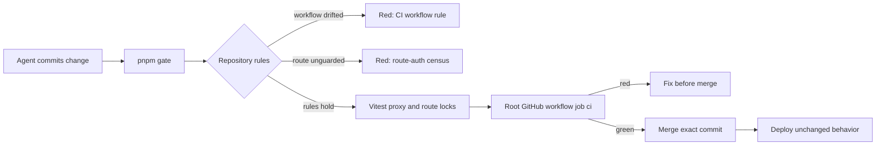

# Harness enforcement

## User story

As Destiny's product owner, I want the merge gate that policy promises to be the gate GitHub actually enforces, and I want the repository's security rules to be executable tests, so an agent cannot ship a route or workflow change that silently weakens authentication or the harness itself.

## Acceptance criteria

1. The GitHub check that runs on every pull request and push to `main` executes the same inventory, migration, lint, Vitest, build, and Playwright gate as `pnpm gate`, from the repository-root workflow, and its job is named `ci`.
2. A workflow file placed below the repository root makes the rule suite red because GitHub will not execute it.
3. Every `src/app/api/**/route.ts` without an in-route authentication guard makes the rule suite red unless the route is explicitly allowlisted with a written justification.
4. Each CMS integration handler returns `401` to an unauthenticated caller before invoking a Supabase Edge Function.
5. `updateSession` has unit tests for API denial, safe login redirect, public paths, the exact Google OAuth entry exception, and website-cookie persistence.
6. Production data and the deployed Replit application remain unchanged by this phase.

## Scenarios

### Scenario: the enforcement gate cannot silently degrade

**Given** the harness workflow defines the merge gate

**When** a change removes the inventory or Playwright step or moves the workflow to an unexecuted path

**Then** `qa/rules/ci-workflow.test.ts` fails in the same commit.

### Scenario: an unguarded API route cannot merge

**Given** an agent adds `src/app/api/<new>/route.ts` without an authentication guard

**When** `pnpm test` runs

**Then** the route-auth census fails and names the file.

### Scenario: the perimeter exception stays narrow

**Given** an unauthenticated request targets `/api/integrations/google/start`

**When** the proxy evaluates it

**Then** only `GET` receives the interactive login redirect and `POST` receives a `401` JSON response.

### Scenario: CMS routes refuse anonymous callers on their own

**Given** the proxy is bypassed

**When** an unauthenticated request reaches a CMS integration handler

**Then** it returns `401` before any Edge Function invocation.

## Flow

## Phase boundary

This phase makes repository enforcement executable and adds defense in depth to CMS routes. It does not create a disposable Supabase tenant, run mutating cross-tenant tests, change authenticated Playwright, schedule production QA, execute production isolation SQL automatically, add schema migrations, or change customer-facing behavior.
