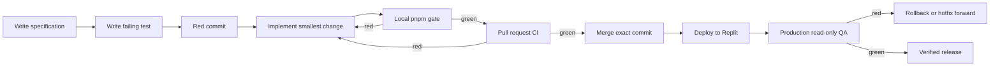

# Destiny test harness

## User story

As Destiny's product owner, I want every product change to prove its intended behavior and preserve existing critical journeys before it can merge or deploy, so coding agents can add features without silently breaking customer workflows or mixing website data.

## Acceptance criteria

1. Pull requests and pushes to `main` run the same locked Node.js, pnpm, inventory, migration, lint, unit, disposable Supabase, build, and Playwright checks.
2. Any failed check makes the GitHub `ci` job red.
3. A route or interactive control added without refreshing `qa/inventory/` makes CI red.
4. A malformed, duplicated, missing, or renamed recorded migration makes CI red.
5. Browser artifacts are retained for fourteen days when Playwright or another CI step fails.
6. The local `pnpm gate` includes the migration check and remains the developer/agent pre-push command.
7. The policy documents red-green-refactor and forbids weakening a test to bypass a failure.
8. The deployed application remains unchanged by Phase 0.
9. Public browser tests run from a clean clone without Supabase secrets or a live Supabase connection.
10. A three-user, three-organization, same-domain fixture proves cross-site read,
    update, delete, blended-parent, shared-membership, and revoked-membership isolation.
11. Every public application table is checked against the migrated Postgres RLS catalog.
12. Every privileged Edge Function receives an executable negative authorization request.
13. WordPress, Webflow, and Wix publishing proofs remain offline and cannot contact a live host.
14. A temporary authenticated Playwright fixture switches between two accessible organizations, preserves the selected website across navigation, and receives `404` for an outsider audit.

## Scenarios

### Scenario: a regression cannot merge

**Given** a pull request changes Destiny behavior

**And** an existing unit or browser test fails

**When** GitHub Actions runs the `ci` job

**Then** the required check is red

**And** the pull request cannot merge after branch protection is enabled.

### Scenario: inventory drift is visible

**Given** a route or interactive control changes

**When** the QA inventory generator produces a diff

**Then** CI fails until the generated inventory is reviewed and committed.

### Scenario: migration history remains recoverable

**Given** a migration has been applied to production

**When** a later change deletes, renames, duplicates, or malformedly names that migration

**Then** `pnpm qa:migrations` fails before the change can merge.

### Scenario: production remains untouched by QA

**Given** a post-deploy production check is running

**When** the browser attempts a mutating Destiny or Supabase request

**Then** the read-only guard blocks it

**And** the test fails with the attempted request recorded as evidence.

## Flow

## Phase boundary

The current harness branch does not deploy or mutate production. It now includes
repository-rule tests, a disposable three-site write matrix, automated SQL and
Postgres-catalog audits, privileged Edge Function denials, and offline CMS
lifecycle tests. Authenticated browser journeys now run against a fourth,
temporary local-only fixture before the disposable stack is destroyed. Any
post-deploy verification remains a separate, credential-gated, read-only lane.
File-size, language-scope, static query, and Deploy Log policy thresholds remain
reserved for product-owner approval.
