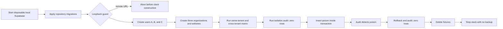

# Disposable three-site isolation

## User story

As Destiny's product owner, I want the repository to recreate Destiny in a disposable local Supabase stack and attempt adversarial writes around three organizations, so a change cannot merge when one website can observe or mutate another website's data.

## Acceptance criteria

1. `supabase/config.toml` recreates the repository migrations locally without production credentials or remote access.
2. `pnpm qa:isolation` refuses every Supabase URL except loopback hosts before constructing a client.
3. The isolation lane creates three verified local users, three organizations, and three websites sharing the same normalized domain through the real Auth, RPC, and PostgREST surfaces.
4. Each registered table proves same-tenant operations succeed and cross-tenant reads and mutations reveal or change zero rows.
5. Parent-pair tables reject blended organization, website, audit, plan, interview, and user identifiers.
6. The existing site-isolation audit returns zero rows for valid fixtures, detects a transaction-scoped poison row, and returns zero rows after rollback.
7. Cleanup removes all three organizations and Auth users even after a failed matrix cell; CI always destroys the local stack with no backup.
8. The default unit-test lane remains Docker-free. The isolation lane runs explicitly in the required GitHub `ci` job with no repository secrets.
9. The two remote-only communication migrations remain a named coverage limitation rather than being silently reconstructed.

## Scenarios

### Scenario: cross-tenant reads reveal nothing

**Given** owners A, B, and C each have a website and child records

**When** the harness tests the A-to-B, B-to-C, and C-to-A boundaries through PostgREST

**Then** every cross-site result is empty and no other owner's value is returned.

### Scenario: cross-tenant writes change nothing

**Given** owner B has an existing registered record

**When** owner A attempts to insert, update, or delete it using B's identifiers

**Then** the request is rejected or affects zero rows and B's record remains unchanged.

### Scenario: blended parent identifiers are rejected

**Given** organization A owns website A and audit A while organization B owns website B and audit B

**When** either owner combines identifiers across those parent chains

**Then** row-level security or a consistency constraint rejects the write.

### Scenario: the detector proves itself

**Given** valid fixtures produce zero audit findings

**When** the harness inserts one blended row inside a database transaction

**Then** `site-isolation-audit.sql` names the expected check and rollback restores zero findings.

## Flow

## Coverage boundary

Phase 2 covers tables represented by migrations in this repository. Production contains two legacy communication migrations without local source files, `destiny_comms_beta` and `index_comms_website_foreign_keys`; their tables cannot be recreated or claimed by this matrix. Authenticated Playwright against the disposable stack, within-organization role escalation, local Edge Functions, scheduled production read-only QA, and production audit execution remain later phases.
